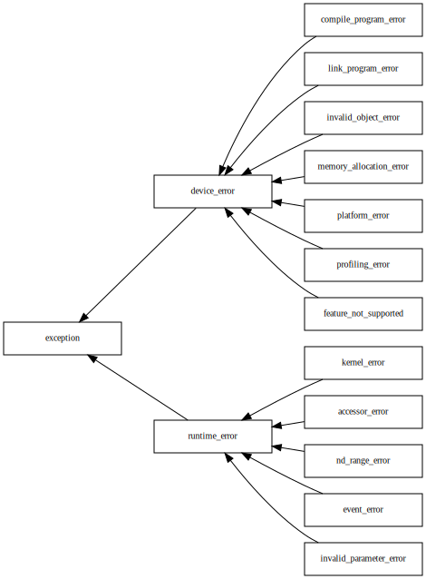

| Proposal ID      | CP026 |
| ---------------- | ----- |
| Name             | Generalized Error Handling For SYCL |
| Date of Creation | 10 March 2020 |
| Target           | SYCL Next |
| Current Status   | *Under Review* |
| Reply to         | Morris Hafner <morris.hafner@codeplay.com> |
| Original author  | Morris Hafner <morris.hafner@codeplay.com> |
| Contributors     | Gordon Brown <gordon@codeplay.com> |

# Generalized Error Handling For SYCL

Motivation
==========

As SYCL generalizes to backends other than SYCL, we are going to need a way to handle errors coming from different backends. Currently we define an exception hierarchy that users can use to catch errors.

This proposal tries to address multiple issues related to error handling at once.

## Issues with current error handling model

### Difficult to compose different backends

Given the SYCL exception hierarchy, it would be difficult to support different backends. All exception class hierarchy based approaches come with drawbacks:

#### Create backend specific exception classes at the leaf classes?

The upside is that this allows the user to catch error categories in a backend-agonostic way:

```c++
try {
    // ...
}
catch(sycl::device_error const&) {
    // backend agnostic catch
}
catch(sycl::vulkan::device_error const&) {
    // vulkan specific error handling
}
```

However, this effectively stops us from adding new exception classes going forward.

```c++
try {
    // ...
}
catch(sycl::new_special_device_error const&) {
    // backend agnostic catch
}
catch(sycl::vulkan::device_error const&) {
    // This class doesn't make sense anymore
}
```

#### Create separate class hierarchies per-backend?

This would solve above problem, but would force the user to write special error handling for each backend. This would hurt the portability of SYCL across different implementations.

```c++
try {
    // ...
}
catch(sycl::vulkan::device_error const&) {
    // ...
}
catch(sycl::vulkan::exception const&) {
    // ...
}
catch(sycl::opencl::device_error const&) {
    // ...
}
catch(sycl::opencl::exception const&) {
    // ...
}
catch(sycl::exception const&) {
    // Backend agnostic catch
    // How do I know it's a device error?
}
```

It becomes clear that we need to get access to the underlying error code inside the exception and provide high level generic exception classes on top of those. 
But simply returning an `int` without an attached meaning is neither convenient nor type safe.

### No return-based error handling

In some cases it might be benefitial for both code style and performance reasons to not throw an exception, but to return an error code, for example if an error condition is a common outcome.

It should also be noted that most GPU programming models don't expose exceptions because they have a C API.

## Interop with error handling libraries

There are libraries for return-based error handling, such as Boost.outcome [[!OUTCOME]] and `llvm::Expected<T>` [[!LLVM-EXPECTED]]. Outcome in particular builds on `error_code`.

# Proposed solution

`<system_error>` is part of C++11 and contains the `std::system_error` exception type that wraps error codes with an associated "meaning" (the error category). `error_code` ships with an error category for POSIX and is being used in [[!ASIO]]. This mechanism is extensible and can be used to wrap backend-specific error codes and group them with a SYCL specific error condition.

## Changes to SYCL

Change `sycl::exception` to the following:

```c++
namespace sycl {
    struct exception : std::exception {
        exception(std::error_code ec, std::string const& what_arg);
        exception(std::error_code ec, char const* what_arg);
        exception(std::error_code ec);
        exception(int ev, error_category const& ecat, std::string const& what_arg);
        exception(int ev, error_category const& ecat, char const* what_arg);
        exception(int ev, error_category const& ecat);
        std::error_code const& code() const noexcept;
        std::error_category const& category() const noexcept;
    };

    struct runtime_error : exception {
        runtime_error(std::error_code ec, std::string const& what_arg);
        runtime_error(std::error_code ec, char const* what_arg);
        runtime_error(std::error_code ec);
    };

    struct device_error : exception {
        device_error(std::error_code ec, std::string const& what_arg);
        device_error(std::error_code ec, char const* what_arg);
        device_error(std::error_code ec);
    };
}
```

The error category of `runtime_error` MUST be `runtime_category()`.
The error category of `device_error` MUST be `device_category()`.

Note: The design of `sycl::exception` follows `std::system_error`, the only difference being the addition of `exception::category()`.

---

Add the following enumerations:

```c++
namespace sycl {
    enum class runtime_errc {
        kernel = /* implementation-defined */,
        accessor = /* implementation-defined */,
        nd_range = /* implementation-defined */,
        event = /* implementation-defined */,
        invalid_parameter = /* implementation-defined */,
    };
    enum class device_errc {
        compile_program = /* implementation-defined */,
        link_program = /* implementation-defined */,
        invalid_object = /* implementation-defined */,
        memory_allocation = /* implementation-defined */,
        platform = /* implementation-defined */,
        profiling = /* implementation-defined */,
        feature_not_supported = /* implementation-defined */
    };

    template<backend b>
    using errc = /* unspecified */
}

namespace std {
    template<>
    struct is_error_condition_enum<sycl::runtime_errc> : true_type{};
    template<>
    struct is_error_condition_enum<sycl::device_errc> : true_type{};
    template<sycl::backend b>
    struct is_error_code_enum<sycl::errc<b>> : true_type{};
}
```

All error codes are distinct and non-zero.

The type aliased by `sycl::errc<backend>` must be an enumeration and must be uniquely defined for all possible values of `backend`.

Note: Typically `sycl::errc` would be implemented using a `backend_traits<backend>` traits class.

Note: The set of enum values in this proposal are based off SYCL 1.2.1, but can be rebased onto any extension or later SYCL revision.
The rest of the proposal is independent of the set of possible errors.

---

Add the following functions:

```c++
namespace sycl {
    std::error_condition make_error_condition(runtime_errc e) noexcept;
    std::error_condition make_error_condition(device_errc e) noexcept;
    std::error_code make_error_code(runtime_errc e) noexcept;
    std::error_code make_error_code(device_errc e) noexcept;
}
```

The return values of `make_error_condition(runtime_errc)` and `make_error_code(runtime_errc e)` are associated with the error category `"sycl runtime"`. The return values of `make_error_condition(device_errc)` and `make_error_code(device_errc e)` are associated with the error category `"sycl device"`.

---

Add the following functions:

```c++
namespace sycl {
    std::error_category const& runtime_category() noexcept;
    std::error_category const& device_category() noexcept;
    template<backend>
    std::error_category const& error_category() noexcept;
}
```

The value returned by `runtime_category().name()` MUST be a pointer to the string `"sycl runtime"`.
The value returned by `device_category().name()` MUST be a pointer to the string `"sycl device"`.
The value returned by `error_category<b>().name()` MUST be a pointer to the string `"[thebackend]"`.

## Backend requirements

All backends MUST declare a specialization of `sycl::error_category<backend::[thebackend]>`.
`sycl::make_error_code<backend>` must construct its return value using `sycl::error_category<backend::[thebackend]>`:
```c++
namespace sycl {
    std::error_code make_error_code(errc<backend::[thebackend]> e);
}
```

All values of `sycl::errc<[thebackend]>` MUST be non-zero except for an optional success error code.

Equivalence must be defined for SYCL device/runtime error categories and the backend error category. The mapping is backend-specific and therefore implementation-defined.

### Example
```c++
    namespace sycl {
        namespace opencl {
            enum class errc {
                success = CL_SUCCESS,
                device_not_found = CL_DEVICE_NOT_FOUND,
                device_not_available = CL_DEVICE_NOT_AVAILABLE,
                compiler_not_available = CL_COMPILER_NOT_AVAILABLE,
                // ...
            };
            static_assert(static_cast<int>(errc::success) == 0);
        }

        template<backend>
        struct backend_traits;

        template<>
        struct backend_traits<backend::opencl> {
            using errc = opencl::errc;
        };

        template<backend b>
        using errc = typename backend_traits<b>::errc;
    }

    assert(sycl::errc<sycl::backend::opencl>::profiling_info_not_available == sycl::device_errc::profiling);
```

# Design considerations

## Should backends define their own exception types?

It is unlikely the user would want to specifically catch an error coming from a certain backend (e. g. `cuda_error`), rather than catching a certain type of error (e. g. `driver_version_mismatch_error`) which could at the same time be a subtype of another future SYCL exception class (see [Motivation](#motivation)). Therefore, the answer should be a "no". If there's a need to handle a backend-specific error, the user can retrieve the backend-specific error code from the high level SYCL exception class hierarchy (see [examples below](#examples)).

## Granularity of error conditions and exception types

The current exception hierarchy looks like this:



There are two ways of grouping the error codes:

* Have a single `sycl::errc` for everything
* Have the device errors and the runtime errors separated out

The tradeoff are the additional boilerplate for split up enums versus the convenience for exception-based error handling. This proposal goes for the second option as an attempt to balance it out. 

# Examples

## Exceptions

### Handling an error generically

```c++
sycl::program broken_program_construction(sycl::context const& ctx) {
    return {ctx, rand()}; // Most likely errors with invalid_object_error
}

void catch_any_error(sycl::context const& ctx) {
    try {
        broken_program_construction(ctx);
    }
    catch(sycl::exception const& e) {
        std::cerr << e.what();
    }
}

void catch_runtime_errors(sycl::context const& ctx) {
    try {
        broken_program_construction(ctx);
    }
    catch(sycl::runtime_error const& e) {
        std::cerr << e.what();
    }
}

void catch_program_errors(sycl::context const& ctx) {
    try {
        broken_program_construction(ctx);
    }
    catch(sycl::runtime_error const& e) {
        if(e.code() == sycl::errc::invalid_object_error) {
            std::cerr << e.what();
        }
        else {
            throw;
        }
    }
}
```

### Handling a backend-specific error

```c++
sycl::program broken_program_construction(sycl::context const& ctx) {
    return {ctx, rand()}; // Most likely errors with invalid_object_error
}

void catch_cl_errors(sycl::context const& ctx) {
    try {
        broken_program_construction(ctx);
    }
    catch(sycl::runtime_error const& e) {
        if(e.category() == sycl::error_category<sycl::backend::opencl>()) {
            switch(e.code().value()) {
                case CL_INVALID_PROGRAM: // ...
            }
        }
        else if(e.category() == sycl::error_category<sycl::backend::vulkan>()) {
            std::cerr << e.what();
        }
        else {
            throw;
        }
    }
}
```

## Return-based

```c++
sycl::program broken_program_construction(sycl::context const& ctx, std::error_code &ec) {
    ec = sycl::errc<sycl::backend::opencl>::invalid_program;
    return {ctx};
}

void generic(sycl::context &ctx) {
    std::error_code ec{};
    broken_program_construction(ctx, ec);
    if(ec) {
        assert(!"broken program");
    }
    // success path
}

void opencl(sycl::context &ctx) {
    std::error_code ec{};
    broken_program_construction(ctx, ec);
    if(ec == sycl::errc<backend::opencl>::invalid_program) {
        assert(!"broken program");
    }
    // success path
}
```

## Utility library based

```c++
template <typename T>
using result = BOOST_OUTCOME_V2_NAMESPACE::result<T, std::error_code>;

result<std::string> get_platform_info(cl_platform_id platform, cl_platform_info param_name) {
    char const *result;
    auto err = std::error_code(clGetPlatformInfo(platform, param_name, sizeof(result), &result, nullptr),
                               sycl::error_category<sycl::backend::opencl>());
    if (err) {
      return err;
    }
    return std::string{result};
}

void boost_outcome() {
    auto const platform_info = get_platform_info(nullptr, CL_PLATFORM_NAME);
    if (platform_info) {
        std::cout << "get_platform_info succeeded with value " << platform_info.value() << '\n';
    } else {
        assert(platform_info.error() == sycl::opencl::errc::invalid_platform);
        assert(platform_info.error().message() == "invalid platform");
        assert(platform_info.error() == sycl::error::platform);
    }
}
```


[!OUTCOME]: https://www.boost.org/doc/libs/1_72_0/libs/outcome/doc/html/index.html
[!LLVM-EXPECTED]: https://llvm.org/doxygen/classllvm_1_1Expected.html
[!ASIO]: https://think-async.com/Asio/
