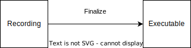
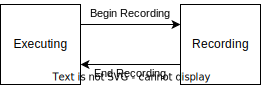

# SYCL_EXT_CODEPLAY_GRAPHS

| Proposal ID | CP030 |
|-------------|--------|
| Name | SYCL_EXT_CODEPLAY_GRAPHS |
| Date of Creation | 08 February 2022 |
| Last Update | 13 September 2022 |
| Version | v1.0 |
| Target | SYCL 2020 vendor extension |
| Current Status | _Work In Progress_ |
| Implemented in | ComputeCpp prototype |
| Reply-to | Ewan Crawford <ewan@codeplay.com> |
| Original authors | Ewan Crawford <ewan@codeplay.com>, Duncan McBain <duncan@codeplay.com>, Ben Tracy <ben.tracy@codeplay.com> |
| Contributors | Ewan Crawford <ewan@codeplay.com>, Duncan McBain <duncan@codeplay.com>, Ben Tracy <ben.tracy@codeplay.com>, Peter Žužek <peter@codeplay.com>,  Ruyman Reyes <ruyman@codeplay.com>, Gordon Brown <gordon@codeplay.com>, Erik Tomusk <erik@codeplay.com>,  Bjoern Knafla <bjoern@codeplay.com>,  Lukas Sommer <lukas.sommer@codeplay.com> |

Paragraphs written in _italics_ are used for non-normative text adding editorial
comments.

## Motivation

### Introduction

Through the use of command groups SYCL is already able to create a DAG of kernel
execution at runtime, as a command group object defines a set of requisites
(edges) which must be satisfied for kernels (nodes) to be executed. However,
because command-group submission is tied to execution on the queue, without
having a prior construction step before starting execution, optimization
opportunities are missed from the runtime not knowing the complete dependency
graph ahead of execution.

The following benefits would become available if the user could define a
dependency graph to the SYCL runtime prior to execution:

* Reduction in runtime overhead by only submitting a single graph object, rather
  than many individual commands.

* Enable more work to be done offline, in particular producing a graph ahead of
  time allows for improved performance at runtime from reduced overhead.

* Unlock DMA hardware features through graph analysis by the runtime.

* Whole graph optimizations become available, including but not limited to:
    * Kernel fusion/fission.
    * Inter-node memory reuse from data staying resident on device.
    * Identification of the peak intermediate output memory requirement, used
      for more optimal memory allocation.

As well as benefits to the SYCL runtime, there are also advantages to the user
developing SYCL applications, as repetitive workloads no longer have to
redundantly issue the same sequence of commands. Instead, a graph is only
constructed once and submitted for execution as many times as is necessary, only
changing the data in input buffers or USM allocations. For machine learning
applications where the same command group pattern is run repeatedly for
different inputs, this is particularly useful.

### Vision

This extension currently takes the form of a Codeplay vendor extension to
make it easier to prototype and distribute an implementation for feedback.
However, the long term goal is collaboration towards a KHR extension or
integration into SYCL Next.

Despite being a vendor extension the intention is that SYCL graphs should be
implementable on multiple backends as enabled by SYCL 2020. Although in the
short term Codeplay's prototype ComputeCpp implementation primarily targets an
OpenCL backend with the [command-buffer][opencl-command-buffers] and
[layered mutable dispatch][opencl-mutable-dispatch] extensions, we are keen not
to encode any backend assumptions in this SYCL extension.

### Requirements

In order to achieve the goals described in previous sections, the following
requirements were considered:

1. Ability to update inputs/outputs of the graph between submissions, without
   changing the overall graph structure.
2. Enable low effort porting of existing applications to use the extension.
3. Profiling, debugging, and tracing functionality at the granularity of graph
   nodes.
4. Integrate sub-graphs (previously constructed graphs) when constructing a new
   graph.
5. Support the USM model of memory as well as buffer model.
6. Compatible with other SYCL extensions and features, e.g kernel fusion &
   built-in kernels.
7. Ability to record a graph with commands submitted to different devices in the
   same context.
8. A graph constructed using a device queue may be executed on another compatible
   queue.
9. Capability to serialize graphs to a binary format which can then be
   de-serialized and executed. This is helpful for offline cases where a graph
   can be created by an offline tool to be loaded and run without the end-user
   incurring the overheads of graph creation.
10. Backend interoperability, the ability to retrieve a native graph object from
    the graph and use that in a native backend API.

To allow for prototype implementations of this extension to be developed
quickly for evaluation the scope of this proposal was limited to a subset
of these requirements. In particular, the serialization functionality (9),
backend interoperability (10), and a profiling/debugging interface (3) were
omitted. As these are not easy to abstract over a number of backends without
significant investigation. It is also hoped these features can be exposed as
additive changes to the API, and so in introduced in future versions of the
extension.

Another reason for deferring a serialize/deserialize API (9) is that its scope
could extend from emitting the graph in a binary format, to emitting a
standardized IR format that enables further device specific graph optimizations.

As described in [Design Discussion](#no-explicit-graph-api) this proposal
defines an implicit recording design for constructing the graph rather than an
explicit graph construction API. It is envisioned that an explicit API could
better express several of the requirements above. In particular the ability
for a user to specify exactly what device they'd like a node to run on when
constructing multiple device graphs (7). See the section on
[single queue submit](#single-queue-submit) for more discussion on the multiple
device use case.

## Extension

### SYCL Graph Definition

A SYCL graph is a collection of nodes and edges. From the SYCL perspective, this
graph will be acyclic and directed (DAG) as users cannot express a cycle in the API.

#### Node

Nodes in a SYCL graph are defined as each of the command group submissions of the
program. Each submission encompasses either one or both of a.) some data movement,
b.) a single asynchronous kernel launch. Nodes cannot define forward edges, only
backwards (i.e. kernels can only create dependencies on things that have already
happened). This means that transparently a node can depend on a previously
recorded graph (sub-graph), which works by creating edges to the individual nodes
in the old graph. Explicit memory operations without kernels, such as a memory
copy, are still classed as nodes under this definition, as the [SYCL 2020
specification states][explicit-memory-ops] that these can be seen as specialized
kernels executing on the device.

#### Edge

An edge in the SYCL-graph represents a data dependency between two nodes. These
dependencies are expressed by the user code through buffer accessors. There is
also the partial ability to track USM data dependencies provided the pointers
used in the graph nodes are the same. With the limitation that a node taking
an offset USM pointer input will not be identified as having an edge to
another node taking a pointer input to the base address of the same USM
allocation.

### API Modifications

```cpp
namespace sycl {
namespace ext::codeplay {

// State of a queue, returned by info::queue::state
enum class queue_state {
  executing,
  recording
};

// State of a graph
enum class graph_state {
  recordable,
  executable
};

// New object representing graph
template<graph_state State = graph_state::recordable>
class command_graph {
public:
  /* Available only when: (State == graph_state::recordable) */
  command_graph(const property_list &propList = {});
  /* Available only when: (State == graph_state::recordable) */
  command_graph<graph_state::executable> finalize(context &syclContext);
  /* Available only when: (State == graph_state::executable) */
  void update(const command_graph<graph_state::recordable> &graph);
};
}  // namespace ext::codeplay

// New methods added to the sycl::queue class
class queue {
public:
  bool begin_recording(command_graph<graph_state::recordable> &graph);
  bool end_recording();
  event submit(command_graph<graph_state::executable> graph);
};
}  // namespace sycl
```

#### Feature Test Macro

This extension defines the [feature test macro][feature test macro]
`SYCL_EXT_CODEPLAY_GRAPHS` which will be set to one of the following values
depending on the version of the specification supported.

| Value | Description            |
|-------|------------------------|
| 1     | First released version |

#### New Graph Class

This extension adds a new `command_graph` object which follows the
[common reference semantics][common reference semantics] of other SYCL runtime
objects.

The `command_graph` object represents a collection of
[command-group nodes](#node) and [their execution dependencies](#edge). A
graph is built up by recording queue submissions, then once the user is happy
that the graph is complete, the graph instance is finalized into an executable
variant which can have no more nodes added to it. Finalization may be a
computationally expensive operation as the runtime is able to perform
optimizations based on the graph structure. After finalization the graph can be
submitted for execution on a queue one or more times with reduced overhead.

It is possible to submit an executable graph to a queue which is in the
recording state. This will cause the graph being submitted to be added as a node
in the graph being recorded to by the queue, this graph node is referred to as a
*sub-graph*.

##### Graph State

An instance of a `command_graph` object can be in one of two states:

* Recording - Graph is under construction and new nodes may be added to it.
* Executable - Graph topology is fixed after finalization and graph is ready to
  be submitted for execution.

A `command_graph` object is constructed in the *recording* state and is made
*executable* by the user invoking `command_graph::finalize()` to create a
new executable instance of the graph. An *executable* graph cannot transition
back to the *recording* state. After finalizing a graph in the *recordable*
state it is valid for a user to add additional nodes and finalize again to
create subsequent *executable* graphs. The state of a `command_graph` object
is made explicit by templating on state to make the class strongly typed, with
the default template argument being `graph_state::recordable` to reduce code
verbosity on construction.

|  |
|:--:|
| <center> **Graph State Diagram** </center> |

##### Graph Update

A graph in the *executable* state can have each nodes inputs & outputs updated
using the `command_graph::update()` method. This takes a graph in the
*recordable* state and updates the executable graph to use the node input &
outputs of the recordable graph. The recordable graph must have the same
topology as the graph originally used to create the executable graphs, with the
nodes added in the same order.

##### Graph Member Functions

```cpp
command_graph::command_graph<graph_state::recordable>(const property_list &propList = {});
```

Creates a SYCL `command_graph` object in the *recording* state.
Zero or more properties can be provided to the constructed SYCL `command_graph`
via an instance of `property_list`.

Preconditions:

* This constructor is only available when the `command_graph` state is
  `graph_state::recordable`.

Parameters:

* `propList` - Optional parameter for passing properties. No new properties are
  defined by this extension.

```cpp
command_graph<graph_state::executable> command_graph<graph_state::recordable>::finalize(context &syclContext);
```
Synchronous operation that creates a graph in the *executable* state with a
fixed topology that can be submitted for execution on any queue sharing the supplied context.
It is valid to call this method multiple time to create subsequent executable graphs. It is also
valid to continue to add new nodes to the recordable graph instance after calling this
function. It is valid to finalize an empty graph instance with no recorded
commands.

Preconditions:

* This member function is only available when the `command_graph` state is
  `graph_state::recordable`.

Parameters:

* `syclContext` - The context asscociated with the queues to which the executable graph will be able to be submitted.

Returns: An executable graph object which can be submitted to a queue.

```cpp
void command_graph<graph_state::executable> update(const command_graph<graph_state::recordable> &graph);
```

Updates the executable graph node inputs & outputs from a topologically
identical recordable graph. The effects of the update will be visible
on the next submission of the executable graph without the need for additional
user synchronization.

Parameters:

* `graph` - Recordable graph object to update graph node inputs & outputs with.
  This graph must have the same topology as the original graph used on
  executable graph creation.

Preconditions:

* This member function is only available when the `command_graph` state is
  `graph_state::executable`.

Exceptions:

* Throws synchronously with error code `invalid` if the topology of `graph` is
  not the same as the existing graph topology, or if the nodes were not added in
  the same order.

#### Queue Class Modifications

This extension modifies the [SYCL queue class][queue class] such that
[state](#queue-state) is introduced to queue objects, allowing an instance to be
put into a mode where command-groups are recorded to a graph rather than
submitted immediately for execution.

[Three new member functions](#new-queue-member-functions) are also added to the
`sycl::queue` class with this extension. Two functions for selecting the state
of the queue, and another function for submitting a graph to the queue.

##### Queue State

The `sycl::queue` object can be in either of two states. The default
`queue_state::executing` state is where the queue has its normal semantics of
submitted command-groups being immediately scheduled for asynchronous execution.

The alternative `queue_state::recording` state is used for graph construction.
Instead of being scheduled for execution, command-groups submitted to the queue
are recorded to a graph object as new nodes for each submission. After recording
has finished and the queue returns to the executing state, the recorded commands are
not then executed, they are transparent to any following queue operations.

|  |
|:--:|
| <center> **Queue State Diagram** </center> |

The state of a queue can be queried with `queue::get_info` using template parameter
`info::queue::state`. The following entry is added to the
[queue info table][queue info table] to define this query:

| Queue Descriptors    | Return Type                  | Description                    |
|----------------------|------------------------------|--------------------------------|
| `info::queue::state` | `ext::codeplay::queue_state` | Returns the state of the queue |

A default constructed event is returned when a user submits a command-group to
a queue in the recording state. These events have status
`info::event_command_status::complete` and a user waiting on them will return
immediately.

##### Queue Properties

There are [two properties][queue properties] defined by the core SYCL
specification that can be passed to a `sycl::queue` on construction via the
property list parameter. They interact with this extension in the following
ways:

1. `property::queue::in_order` - When a queue is created with the in-order
   property, recording its operations results in a straight-line graph, as each
   operation has an implicit dependency on the previous operation. However,
   a graph submitted to an in-order queue will keep its existing structure such
   that the complete graph executes in-order with respect to the other
   command-groups submitted to the queue.

2. `property::queue::enable_profiling` - This property has no effect on graph
   recording. When set on the queue a graph is submitted to however, it allows
   profiling information to be obtained from the event returned by a graph
   submission.

For any other queue property that is defined by an extension, it is the
responsibility of the extension to define the relationship between that queue
property and this graph extension.

##### New Queue Member Functions

```cpp
bool queue::begin_recording(ext::codeplay::command_graph<graph_state::recordable> &graph)
```

Synchronously changes the state of the queue to the `queue_state::recording`
state.

Parameters:

* `graph` - Graph object to start recording commands to.

_The `command_graph` object is passed by reference in this entry point,
rather than by value, to make it clear that it is not correct behavior
for a graph instance to be destroyed while a queue is recording commands
to that graph_.

Returns: `true` if the queue was previously in the `queue_state::executing`
state, `false` otherwise.

Exceptions:

* Throws synchronously with error code `invalid` if the queue is already
  recording to a different graph.

```cpp
bool queue::end_recording()
```

Synchronously changes the state of the queue to the `queue_state::executing`
state.

Returns: `true` if the queue was previously in the `queue_state::recording`
state, `false` otherwise.

```cpp
event queue::submit(ext::codeplay::command_graph<graph_state::executable> graph)
```

When invoked with the queue in the `queue_state::recording` state, a graph is
added as a subgraph node. When invoked with the queue in the default
`queue_state::executing` state, the graph is submitted for execution. There are
no gurantees that more than one instance of `graph` will execute concurrently.
Submitting a graph for execution, before a previous execution has been completed
may result in serialized execution depending on the SYCL backend and
characteristics of the graph.

Parameters:

* `graph` - Graph object to start recording commands to.

When the queue is in the execution state, an `event` object used to synchronize
graph submission with other command-groups is returned. Otherwise the queue is
in the recording state, and a default event is returned.

_The `command_graph` object is passed by value in this entry point,
rather than by reference, to support the use case where a graph instance is
submitted to a queue and the graph is then destroyed. Copying the graph allows
the queue to still be able to execute the graph submission._

#### Error Handling

Errors are reported through exceptions, as usual in the SYCL API. For new APIs,
submitting a graph for execution can generate unspecified asynchronous errors,
while `command_graph::finalize()` may throw unspecified synchronous exceptions.
Synchronous exception errors codes are defined for both
`queue::begin_recording()` and `command_graph::update()`.

When a queue is in recording mode asynchronous exceptions will not be
generated, as no device execution is occuring. Synchronous errors specified as
being thrown in the default queue executing state, will still be thrown when a
queue is in the recording state.

The `queue::begin_recording` and `queue::end_recording` entry-points return a
`bool` value informing the user whether a state change occurred. False is
returned rather than throwing an exception when state isn't changed. This design
is because the queue is already in the state the user desires, so if the
function threw an exception in this case, the application would likely swallow
it and then proceed.

#### Thread Safety in new functionality

The new functions in this extension are thread-safe, the same as member
functions of classes in the base SYCL specification. If user code does
not perform synchronisation between two threads accessing the same queue,
there is no strong ordering between events on that queue, and the kernel
submissions, recording and finalization will happen in an undefined order.

In particular, when one thread ends recording on a queue while another
thread is submitting work, which kernels will be part of the subsequent
graph is undefined. If user code enforces a total order on the queue
events, then the behaviour is well-defined, and will match the observable
total order.

The returned value from the `info::queue::state` should be considered
immediately stale in multi-threaded usage, as another thread could have
preemptively changed the state of the queue.

#### Storage lifetimes in graph submissions

The lifetime of any buffer recorded as part of a submission
to a command graph will be extended in keeping with the common reference
semantics and buffer synchronization rules in the SYCL specification. It will be
extended either for the lifetime of the graph (including both recordable graphs
and the executable graphs created from them) or until the buffer is no longer
required by the graph (such as after being replaced through whole graph update).

#### Host tasks

A [host task][host task] is a native C++ callable, scheduled according to SYCL
dependency rules. It is valid to record a host task as part of graph, though it
may lead to sub-optimal graph performance because a host task node prevents the
SYCL runtime from submitting the whole graph to the device at once.

Host tasks can be updated as part of [whole graph update](#whole-graph-update)
by replacing the whole node with the new callable. In a future explicit graph
building API we envisage the updating of individual inputs/outputs of
a host task node to be disallowed, as swapping out lambda captures is not
possible in C++. Instead the whole host task callable would be replaced.

### Example Usage

The following snippet of code shows how a SYCL `queue` can be put into a
recording state, which allows a `command_graph` object to be populated
by the command-groups submitted to the queue. Once the graph is complete,
recording finishes on the queue to put it back into the default executing
state. The graph is then finalized so that no more nodes can be added. Lastly,
the graph is submitted as a whole for execution via
`queue::submit(command_graph<graph_state::executable>)`.

```cpp
  queue q{default_selector{}};

  // New object representing graph of command-groups
  ext::codeplay::command_graph<graph_state::recording> graph;
  {
    buffer<T> bufferA{dataA.data(), range<1>{elements}};
    buffer<T> bufferB{dataB.data(), range<1>{elements}};
    buffer<T> bufferC{dataC.data(), range<1>{elements}};

    // `q` will be put in the recording state where commands are recorded to
    // `graph` rather than submitted for execution immediately.
    q.begin_recording(graph);

    // Record commands to `graph` with the following topology.
    //
    //      increment_kernel
    //       /         \
    //   A->/        A->\
    //     /             \
    //   add_kernel  subtract_kernel
    //     \             /
    //   B->\        C->/
    //       \         /
    //     decrement_kernel

    q.submit([&](handler &cgh) {
      auto pData = bufferA.get_access<access::mode::read_write>(cgh);
      cgh.parallel_for<increment_kernel>(range<1>(elements),
                                         [=](item<1> id) { pData[id]++; });
    });

    q.submit([&](handler &cgh) {
      auto pData1 = bufferA.get_access<access::mode::read>(cgh);
      auto pData2 = bufferB.get_access<access::mode::read_write>(cgh);
      cgh.parallel_for<add_kernel>(range<1>(elements),
                                   [=](item<1> id) { pData2[id] += pData1[id]; });
    });

    q.submit([&](handler &cgh) {
      auto pData1 = bufferA.get_access<access::mode::read>(cgh);
      auto pData2 = bufferC.get_access<access::mode::read_write>(cgh);
      cgh.parallel_for<subtract_kernel>(
          range<1>(elements), [=](item<1> id) { pData2[id] -= pData1[id]; });
    });

    q.submit([&](handler &cgh) {
      auto pData1 = bufferB.get_access<access::mode::read_write>(cgh);
      auto pData2 = bufferC.get_access<access::mode::read_write>(cgh);
      cgh.parallel_for<decrement_kernel>(range<1>(elements), [=](item<1> id) {
        pData1[id]--;
        pData2[id]--;
      });
    });

    // queue will be returned to the executing state where commands are
    // submitted immediately for extension.
    q.end_recording();
  }

  // Finalize the recordable graph to create an executable graph that can be
  // submitted for execution.
  ext::codeplay::command_graph<graph_state::executable> exec_graph = graph.finalize(q.get_context());

  // Execute graph
  q.submit(exec_graph);
```

### Design Discussion

#### No Explicit Graph API

The current proposal focuses on an API which implicitly creates a graph by
recording commands, rather than an explicit graph creation API. Primarily the
benefits of this design are it being easier for users to switch their code to
use SYCL graphs with minimal changes, as well as less pressure on initial
implementations.

It is envisioned that in the future an explicit graph API will be
additionally included in the extension and both interfaces would be available to
the user, as with [CUDA Graphs][cuda-graphs]. The design of this explicit API
will be informed by early implementations of the current proposal. This is an
area we are looking to collaborate with other vendors on towards a KHR extension
or SYCL Next.

#### Single Queue Submit

This extension allows a graph to be recorded from multiple different queues,
but ony submitted to a single queue. The device associated with a queue is not
captured by the graph recording, only the commands submitted and their
dependencies. The device used for graph execution is the device associated with
the queue the graph is submitted to, and this device will execute the complete
graph regardless of how the graph was composed from different queues during
recording.

The single queue submission design allows reuse of the normal SYCL
`queue::submit()` mechanism, which is also a natural way to express sub-graphs.
An alternative approach of calling a `command_graph::run()` method on the graph
object itself was proposed, but this made sub-graph capture more difficult and
is inconsistent with the normal SYCL execution model.

The solution for users who would like an execution graph to contain nodes which
execute on different devices in their platform, is to construct a separate
executable graph object representing a sub-graph for each device they'd like to
target. The user must then manually create and schedule the larger graph by
using events as dependencies to connect individual device sub-graphs as
they are submitted. This approach loses the separation of concerns between
defining and scheduling a complete graph, and some of the advantages which go
with it, however it is intended that better support for the multi-device graph
use case will be provided by a future explicit graph building API.

Additionally, if support for multiple devices per queue changes in future SYCL
versions, then this extension can potentially take advantage of it to allow the
above, rather than prematurely rolling its own support.

#### Whole Graph Update

Providing a way to update the inputs & outputs to a graph between submissions,
without modifying the overall topology of the graph, is important functionality
for enabling our target Machine Learning use cases.

Methods for explicitly replacing inputs/edges in an already constructed graph
present many potential problems for both API design and implementers. A simple
find/replace API, e.g. `graph.update(oldBufferList, newBufferList)`, was
considered but the potential implementation was deemed too problematic, and
would require the application to do onerous book keeping to track updates made
to the graph.

Explicit input/edge replacement would also make more sense as part of an
[explicit graph creation API](#no-explicit-graph-api), rather than the implicit
capture API from this version of the proposal. For that reason we have decided
to defer adding it until the explicit graph creation API is introduced.

Instead, this proposal defines a whole graph update mechanism for updating
inputs/edges. This relies on the computationally cheap graph recording being
separated from the computation heavy finalization, and allows for the user to easily
reuse code with new inputs to re-record and update an existing graph all at
once. This is particularly useful for code with many inputs that need updating,
where a manual update could be very complex.

Whole graph update is an idea influenced by
[CUDA Graphs - Whole Graph Update][cuda-whole-graph-update] and the
`command_graph::update()` method for performing this operation is an equivalent
to `cudaGraphExecUpdate`.

If a SYCL backend does not support a mechanism for updating the arguments of
existing commands, then this functionality can be emulated in the SYCL runtime
by constructing a new backend graph object.

#### Explicit Finalize

Separating graph creation into two stages, begin/end recording and explicit
finalization, formalizes the separation of concerns between the expensive
operations involved in executable graph creation & optimization, and the actual
recording of commands which should be low overhead.

An explicit finalize entry-point, rather than returning an executable graph on
end of recording, gives the user more granular control of when these stages
happen in their application. As well as allowing the recording of a queue to a
graph to resume after it has been stopped by an application.

The ability for a user to effectively clone a graph is also possible with
a separate finalize entry-point. A recordable graph can be reused to create
multiple executable graphs by the user repeatedly calling `finalize()`.

## Issues

### Mark Internal Memory

To enable optimizations to remove memory objects internal to the graph, do we
need an interface to identify buffers and USM allocations not used outside of
the graph?

**Outcome:** Intended for next version of the extension.

## Changelog

| Version | Change | Author | Date |
|---------|--------|--------|------|
| 0.1 | Initial Revision | Ewan Crawford | 08/02/2022 |
| 0.2 | Action feedback from end of Q2 2022 | Ewan Crawford | 16/05/2022 |
| 0.3 | Action feedback from end of Q3 2022 | Ben Tracy | 20/07/2022 |
| 1.0 | First public version | Ewan Crawford | 13/09/2022 |

[cuda-graphs]: https://docs.nvidia.com/cuda/cuda-c-programming-guide/index.html#cuda-graphs
[cuda-whole-graph-update]: https://docs.nvidia.com/cuda/cuda-c-programming-guide/index.html#whole-graph-update
[cudaGraphClone]: https://docs.nvidia.com/cuda/cuda-runtime-api/group__CUDART__GRAPH.html#group__CUDART__GRAPH_1g711477355655f00773a0885fbf2891d6
[explicit-memory-ops]: https://www.khronos.org/registry/SYCL/specs/sycl-2020/html/sycl-2020.html#subsec:explicitmemory
[opencl-command-buffers]: https://www.khronos.org/registry/OpenCL/specs/3.0-unified/html/OpenCL_Ext.html#cl_khr_command_buffer
[opencl-mutable-dispatch]: https://www.khronos.org/registry/OpenCL/specs/3.0-unified/html/OpenCL_Ext.html#cl_khr_command_buffer_mutable_dispatch
[common reference semantics]: https://www.khronos.org/registry/SYCL/specs/sycl-2020/html/sycl-2020.html#sec:reference-semantics
[queue class]: https://www.khronos.org/registry/SYCL/specs/sycl-2020/html/sycl-2020.html#sec:interface.queue.class
[queue properties]: https://registry.khronos.org/SYCL/specs/sycl-2020/html/sycl-2020.html#sec:queue-properties
[feature test macro]: https://registry.khronos.org/SYCL/specs/sycl-2020/html/sycl-2020.html#_feature_test_macros
[host task]: https://registry.khronos.org/SYCL/specs/sycl-2020/html/sycl-2020.html#subsec:interfaces.hosttasks
[queue info table]: https://registry.khronos.org/SYCL/specs/sycl-2020/html/sycl-2020.html#table.queue.info
